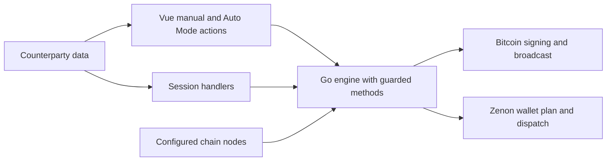
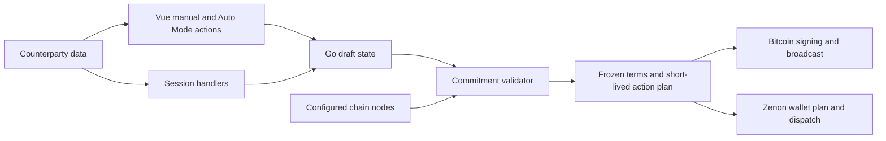

# Security Hardening Proposal: Own the swap commitment boundary

## Decision

We can preserve Ferry's static, noncustodial architecture while making the Go engine responsible for deciding when a swap may commit funds or reveal its secret. I recommend introducing that boundary incrementally after the immediate guards are in place. This is a proposal; the audit made no application changes and closed no vulnerabilities.

## Executive Recommendation

Option 1, **strengthen the existing methods**, adds the missing checks to the current audit, verification, create and redeem paths. Option 2, **freeze terms and issue validated action plans**, makes those methods consume one shared decision tied to current chain evidence. We should ship the necessary local guards immediately and move toward Option 2 as the durable design. Option 1 remains reasonable if the API surface will stay small and maintainers can demonstrate that every dangerous call consistently enforces the same invariants.

## Evidence

I inspected the source paths carrying peer-controlled values into the transaction builders and the UI callers that expose them. The decisive observation is that a warning or successful check in one layer does not establish all the conditions required by the later operation. The following evidence keys are stable candidate identifiers from the unsealed scan; the source revision is `be879e1bd61a9922ee58e16d32095bafa43bdf6e`.

| Evidence and short title | Source | What it establishes |
| --- | --- | --- |
| `btc-underfunding` — Underpayment releases secret | `wasm/manager.go:945`, `ui/src/components/SwapCard.vue:737` | Existing funding plus confirmation can authorize first disclosure without the agreed amount. |
| `btc-unconfirmed-create` — Unconfirmed Bitcoin precedes Zenon lock | `wasm/walletblock.go:235` | An audited script is accepted as enough to build the participant's funded Zenon block. |
| `incomplete-zenon-terms` — Missing recipient or amount passes verification | `wasm/znn/client.go:450`, `wasm/manager.go:1120` | Absent expectations disable checks while the result can still be marked verified. |
| `nonminimal-contract-push` — Audited script fails redeem | `wasm/htlc.go:179`, `wasm/txbuild.go:196` | The audit and spending engine accept different script representations. |
| `contract-replacement` — Funded script remains mutable | `wasm/manager.go:438` | Re-audit replaces the script without binding or invalidating stored funding. |
| `cli-offer-command-injection` — Amount becomes shell syntax | `ui/src/core/zenon-commands.ts:94` | The optional CLI generator needs separate input and shell-encoding fixes. |
| `board-inbox-timestamp` — Malformed time disables inbox | `ui/src/components/BoardInbox.vue:94` | The board renderer needs independent bounds and error containment. |

These are observed source properties. We infer a common ownership problem from the first five: the system stores partial facts in a mutable record and several callers interpret those facts as permission to advance. That inference motivates the proposed boundary; it does not establish that the redesign is implemented or sufficient without tests. The last two findings are separate trust boundaries and should receive local fixes.

## Current Design And Failure Mode

Both manual controls and Auto Mode call the browser's WASM API. Peer session messages can also update the swap through audit operations. The Go engine stores the contract, funding record and Zenon verification status in the same mutable swap object. Transaction methods validate useful individual conditions, but the conditions are distributed: confirmation appears in one UI path, value mismatches can be warnings, and a boolean verification result can outlive its original evidence.

We therefore cannot treat an audited script or a verified flag as a complete capability to move value. In particular, checking the new script's terms does not establish that it is the script at the stored Bitcoin outpoint. Checking only present expected fields does not establish that the incoming Zenon leg pays the user. These distinctions are directly relevant to the proposed representation.

## Desired Invariants

- Before first secret disclosure, the receiving leg must be payable to this participant, hold at least the agreed amount, and remain claimable with the required time margin.
- Before the participant commits the second leg, the initiating leg must be currently funded, sufficiently confirmed and bound to the frozen contract.
- Successful verification must require complete expectations: recipient, agreed token, positive amount, hash and admissible expiry.
- A committed swap's contract bytes and economic terms cannot change. Identical retransmissions remain idempotent.
- A chain action consumes evidence for its exact swap, network, contract and operation; stale observations cannot silently authorize another action.

## Constraints And Non-Goals

We assume a balanced priority between time to repair and recurrence prevention. No performance or memory budget was supplied. We should preserve the current static distribution, external wallet custody, both initiating-chain orderings, and offline recovery. Configured nodes remain trusted sources of chain observations; adding a proof system or new server is outside this proposal. CLI quoting and board rendering remain separate work. Recovery of an already exposed secret must not be blocked by a normal-trade guard that no longer protects a secret.

## Before Architecture

We currently allow both UI and session paths to reach the same mutable engine state. The diagram shows authority flow rather than separate processes.

The two outputs are different irreversible boundaries: Ferry signs Bitcoin itself with its per-swap key, while the Zenon wallet signs and publishes a plan. Moving checks only into a Vue button would leave the direct API and alternate callers exposed.

## Options

### Option 1: Strengthen the existing methods

We can keep the current data model and add focused guards at `Redeem`, `planCreate`, `VerifyZenon` and `AuditContract`. The parser should accept only canonical scripts. For each dangerous method, the engine would obtain current evidence and refuse unsafe transitions; the UI would display that refusal. This option has the smallest migration footprint and is the fastest way to remove the reported paths.

The cost is continued duplication. A future method could forget a confirmation requirement or infer success from a partial record. We can reduce that risk with shared predicates and tests over every public entry point, but callers would still have to use them correctly. Fresh node reads also add latency and make a node outage a visible refusal. That is an acceptable safety property for new commitments, provided offline recovery remains a separate explicit operation.

We could deploy these guards without changing storage format, making rollback operationally simple. A rollback must retain the security guards or disable affected new-swap actions; restoring the vulnerable behavior is not an acceptable recovery plan. We would measure node-call count, preparation latency and WASM memory across representative swaps before changing refresh behavior.

| Change | Before | After | Security consequence | Cost |
| --- | --- | --- | --- | --- |
| Method guards | Partial facts authorize actions | Every dangerous method checks complete conditions | Closes known missing gates | Repeated policy maintenance |
| Contract audit | Parsed fields accepted | Canonical bytes and commitment freeze | Aligns audit with spending and funding | Compatibility handling for old drafts |
| Chain observation | Cached state can be enough | Fresh evidence at commitment/disclosure | Narrows stale-state failures | Node latency and fail-closed outages |

The boundary stays in familiar methods. That makes this a useful immediate repair, but tests and review discipline remain responsible for consistency across methods.

### Option 2: Freeze terms and issue validated action plans

We can make complete agreed terms and a canonical contract an explicit engine-owned value. Drafts may remain incomplete while participants exchange data, but they cannot produce a commitment plan. At the first commitment the engine freezes the exact terms and contract identity. A validator reads fresh chain facts and returns an operation-specific plan containing the swap version, network, contract hash, referenced funding or HTLC identity, amount, recipient and observation time. Signing and wallet dispatch consume that plan only if its identity and freshness still match.

This is an internal Go representation, not a token exposed for callers to forge. The JS API would request an action rather than assemble proof fields. Session handlers could update drafts, retransmit identical committed values or report a conflict; they could not replace the committed contract. Verification would distinguish incomplete, invalid, valid-but-stale and currently actionable states instead of collapsing them into one boolean.

The stronger boundary makes control drift harder, but it creates a migration obligation. Existing stored swaps cannot be assumed to satisfy the new invariants. We would read them conservatively, reconstruct canonical terms where possible, and require fresh verification before new commitments. Records that cannot migrate must retain a visible route to export and offline recovery. Keeping the old read format during rollout would allow reverting UI and storage changes while retaining local security guards.

Resource effects are limited to a few additional terms and evidence records per active swap, but that is a source-derived expectation, not a measurement. Node requests dominate expected latency; repeated observations could be shared within a bounded plan lifetime if we can show that they belong to the same exact action. There is no new service or network hop. The validator becomes a more important reliability component, so failures must give precise reasons, release pending UI state and permit safe retry without double funding.

A plan cannot eliminate chain changes after a user sees a wallet prompt. We still need short validity, final dispatch checks where possible, clear expiry handling and tests for delays and replaced funding. The unresolved expired-Unlock publication question also remains a wallet integration question: freshness validation mitigates it, but only a supported-wallet experiment can establish where the secret becomes public.

| Change | Before | After | Security consequence | Cost |
| --- | --- | --- | --- | --- |
| Action authority | Mutable flags interpreted by several methods | Validator issues an exact operation plan | Central ownership of commitment and disclosure invariants | New internal types and call contracts |
| Terms lifetime | Contract can be overwritten after funding | Frozen terms plus idempotent resends | Funding cannot silently point at a replacement script | Stored-record migration |
| Evidence lifetime | Boolean verification survives observations | Identity-bound and time-bounded evidence | Stale or unrelated evidence cannot authorize action | Freshness and retry logic |

The useful change is who owns permission to move value. We keep external wallets and configured nodes in their existing roles, while reducing the number of places that can interpret a partial swap record as safe.

## Comparison

All estimates below are source-derived or hypothetical; no latency or memory measurements were made. We should measure against the current build on the same nodes and refuse a design that introduces duplicate funding requests or blocks offline recovery.

| Dimension | Option 1: method guards | Option 2: validated plans | Measurement or acceptance check |
| --- | --- | --- | --- |
| Security | Addresses known paths; future call-site drift remains | Centralizes policy and immutable identities; validator correctness becomes critical | Original regression cases and direct API bypass tests |
| Performance | Extra fresh reads before dangerous methods | Similar reads, possible bounded reuse within one plan | Prepare/dispatch latency and RPC counts under normal and delayed nodes |
| Memory | Small temporary observations | Retained bounded evidence per active swap | WASM memory for 1, 10 and 100 active records; no growth after closure |
| Reliability | Fail-closed node outages; familiar retry paths | Explicit rejection states; plan expiry and version conflicts add cases | Timeout, reorg/replacement, stale plan and retry simulation |
| Operability | Existing error plumbing needs clearer refusals | More structured local reasons; no server required | Confirm diagnostics exclude secrets and identify actionable failures |
| Migration | Mainly compatible method behavior | Read old records, revalidate and freeze before action | Old exports and live funded records remain recoverable |
| Developer ergonomics | Small changes but repeated obligations | One action contract, more types to learn | Review all API consumers and document invariants |
| Reversibility | Easy code rollback with guards retained | Keep old readers and gate new writes during rollout | Rehearse downgrade without discarding keys or funding records |

Option 2's main cost is compatibility engineering, not a presumed runtime speed penalty. If we cannot safely migrate existing funded records, we should keep Option 1 in production while completing that work.

## Recommendation

I recommend Option 2 as the target and Option 1's guards as the immediate protection. The cluster of five independent protocol failures makes a shared action boundary proportionate. If maintainers expect no growth in action paths and can maintain comprehensive entrypoint tests, stopping at Option 1 is defensible. A new server, a custody service or a separate process would add substantial operational cost without fixing the evidenced protocol checks by itself.

## Evidence Coverage And Residual Risk

| Evidence and short title | Option 1 | Option 2 | Tactical fix still required |
| --- | --- | --- | --- |
| `btc-underfunding` — Underpayment releases secret | Addresses | Addresses through disclosure plan | Yes: amount gate immediately |
| `btc-unconfirmed-create` — Unconfirmed Bitcoin before Zenon lock | Addresses | Addresses through commitment plan | Yes: confirmation/value/binding gate |
| `incomplete-zenon-terms` — Incomplete verification | Addresses | Addresses through complete terms | Yes: missing terms fail closed |
| `nonminimal-contract-push` — Redeem-blocking script | Addresses | Addresses only with canonical constructor | Yes: canonical parsing |
| `contract-replacement` — Mutable funded script | Addresses | Addresses through frozen identity | Yes: mutation guard |
| `cli-offer-command-injection` — Shell syntax in amount | Unaffected | Unaffected | Yes: decimal validation and shell encoding |
| `board-inbox-timestamp` — Inbox date failure | Unaffected | Unaffected | Yes: bounds and total formatting |

Neither option makes a compromised same-origin page trustworthy, proves configured nodes honest, or removes normal blockchain finality risk. We must preserve these residual assumptions in product documentation. The designs are also not evidence that the original findings have been fixed.

## Migration And Rollout

We should first ship local guards with focused regression tests. The plan-based model can then be exercised against existing records in a read-only comparison mode, recording only safe local decision reasons. Before permitting new plan writes, test both initiating chains, old recovery files and delayed wallet prompts. Retain versioned readers and keys through rollback; if validation fails, disable new commitments while leaving export and recovery available.

## Validation Plan

We need tests at the actual public WASM APIs and wallet plan boundary, including direct calls that bypass Vue availability checks. Use local Bitcoin and Zenon test chains for underpayment, replacement, confirmation, expiry and missing-recipient cases. Exercise nonminimal scripts against the actual pinned script engine and require accepted contracts to support the intended branches. Test session replays before and after commitment and failed state saves. A supported-wallet experiment must determine whether expired Unlock calldata leaks before rejection. None of those integration results was obtained in this audit.

## Implementation Work Packages

The reviewable work is to add immediate guards and regression cases, define complete and frozen terms, define operation plans and freshness rules, migrate stored state conservatively, then update callers and documentation. Detailed implementation planning should follow the design choice. Acceptance requires the original dangerous paths to fail before commitment or disclosure while valid swaps in both directions and offline recovery continue to work.

## Open Questions

We need a product decision on the confirmation threshold and minimum remaining time for the intended transaction sizes. We also need supported wallet behavior for stale Unlocks, an inventory of legacy export formats in actual use, and measured node latency before choosing plan validity. These unknowns affect implementation parameters; they do not justify leaving the demonstrated missing checks in place.

